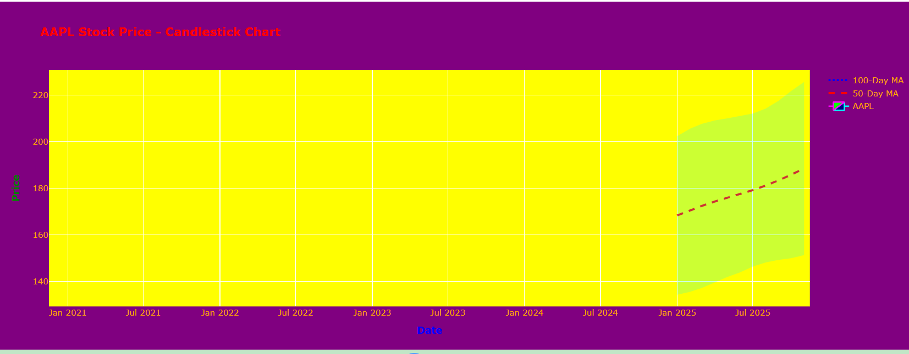
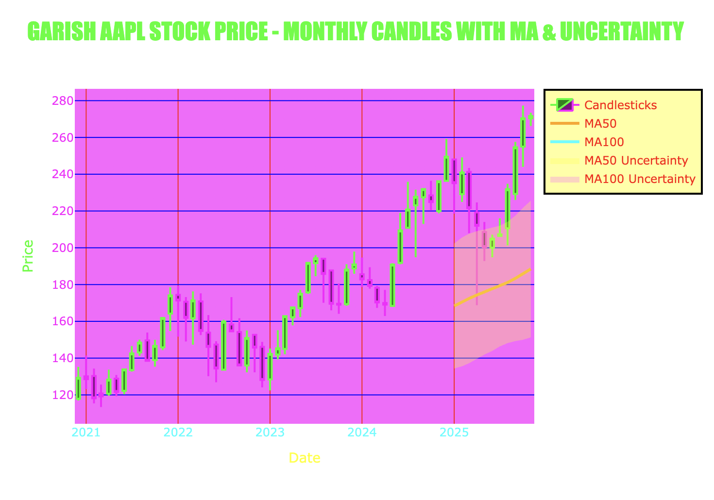
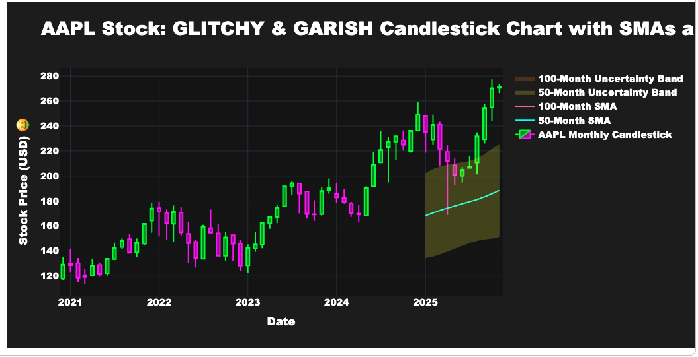
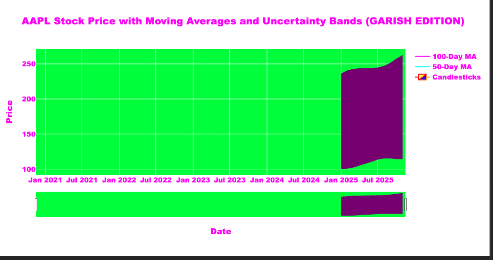

# Vibe coding workshop materials

In each folder, look for `prompt.md` to see the Google Colab prompts and a final working app can be found in `code.py`

Slides from the workshop are available in "Vibe coding workshop slides Nov 6 2025.pptx" in the main folder

# Participant examples from the Apple stock tracker

1 prompt, totally different results! 

